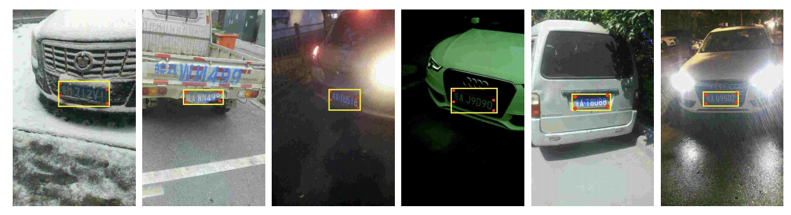
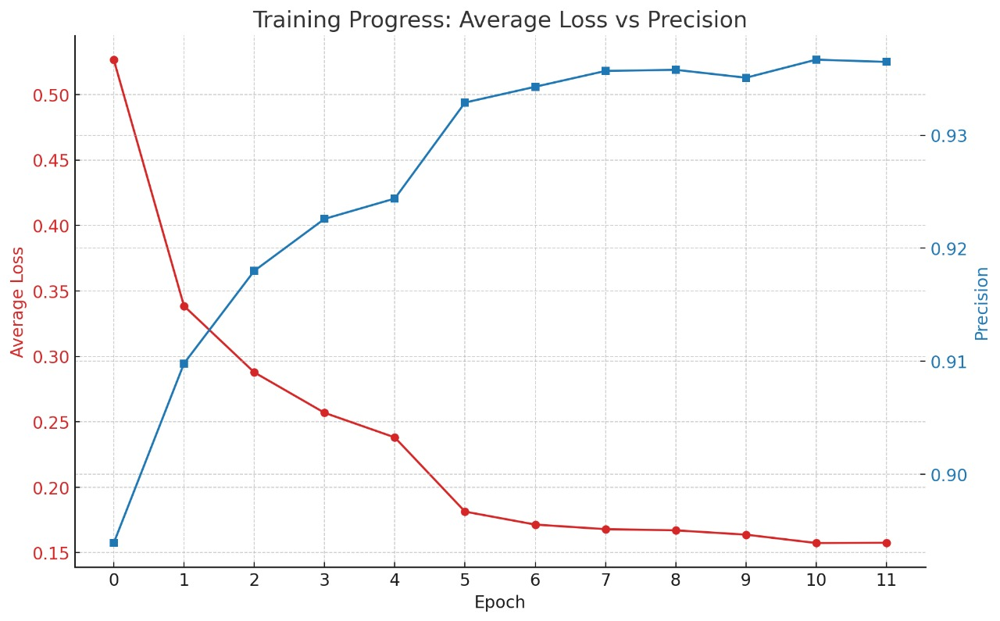
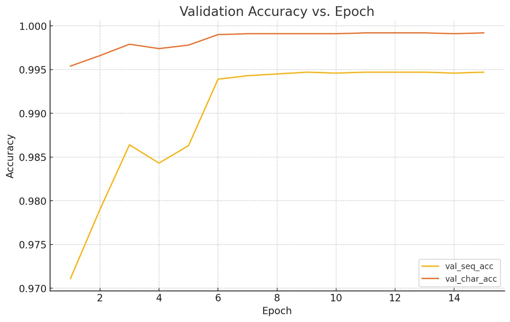
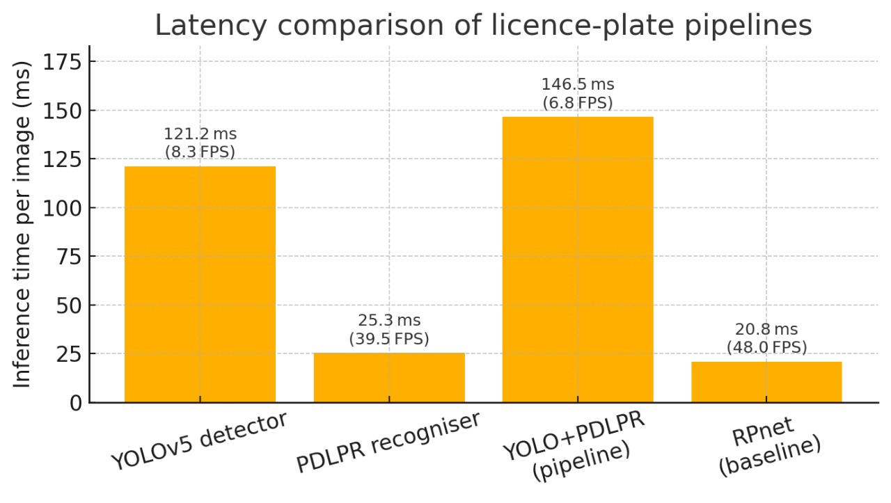
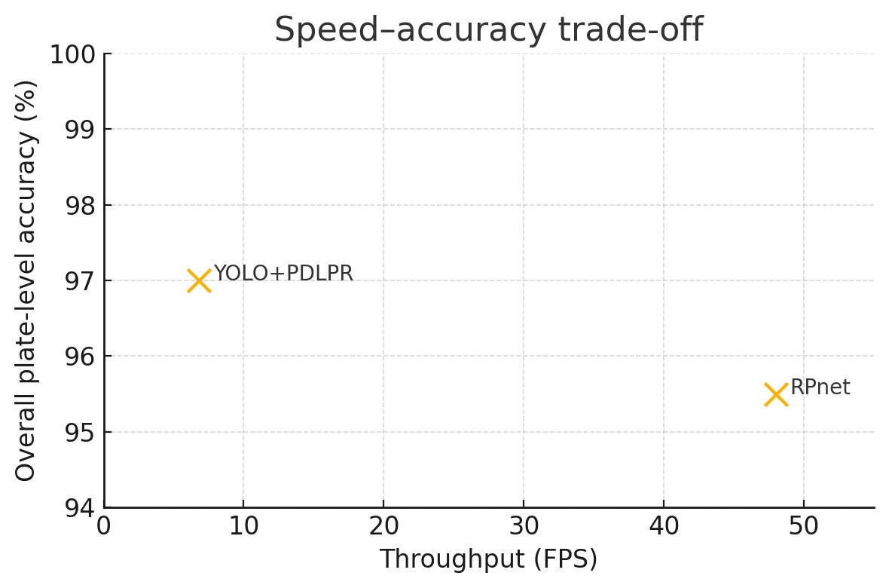
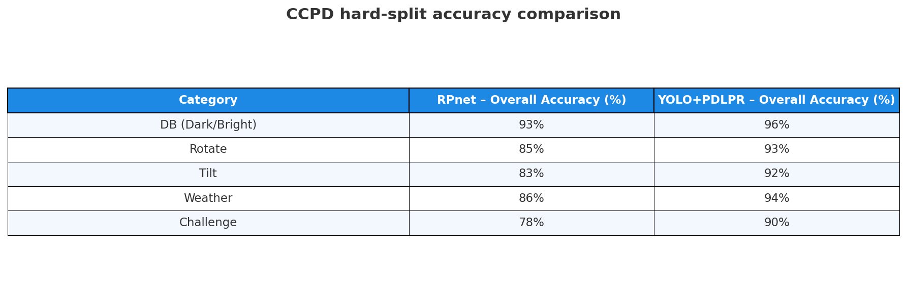

# Computer‑Vision‑Project  
*End‑to‑End Chinese Licence‑Plate Detection & Recognition on CCPD*

**Author:** Ali Subhan  
**Repo:** <https://github.com/AliSubhan5341/computer-vision-project>  
**Last update:** 18 Jun 2025

---

## Table of Contents
1. [Project Overview](#1-project-overview)  
2. [Dataset: CCPD Explained](#2-dataset-ccpd-explained)  
3. [Repository Layout](#3-repository-layout)  
4. [Installation](#4-installation)  
5. [How to Run](#5-how-to-run)  
6. [Implementation Details](#6-implementation-details)  
7. [Evaluation Protocol](#7-evaluation-protocol)  
8. [Results & Speed Profile](#8-results--speed-profile)  
9. [Limitations & Future Work](#9-limitations--future-work)  
10. [References](#10-references)  
11. [License](#11-license)  

---

## 1  Project Overview
This repository contains **two independent licence‑plate recognition systems**
implemented on the Chinese City Parking Dataset (**CCPD**).  
The aim is to demonstrate how modern detection and sequence‑modelling
techniques improve accuracy and robustness over the original 2018 baseline,
while also quantifying the latency cost.

| Pipeline folder | Detector | Recogniser | Origin paper |
|-----------------|----------|------------|--------------|
| `Baseline/` | Lightweight SSD‑style CNN | **RPnet** (ROI‑pool + 7 softmax heads) | Xu *et al.*, *ECCV 2018* |
| `YOLO+PDLPR/` | **YOLOv5‑s** (Ultralytics) | **PDLPR** (IGFE + Transformer encoder/parallel decoder) | Tao *et al.*, *Sensors 2024* |

Both pipelines follow exactly the same data interface so their results can be
compared under identical conditions.

> **Note on borrowed code and baseline re-implementation**  
> * Dataset helpers (`provinces`, `alphabets`, `ads` lookup tables,  
>   `filename_to_indices()` parser, IoU-tilt utilities, etc.) are **ported directly**  
>   from the original CCPD GitHub repository  
>   <https://github.com/detectRecog/CCPD>.  Only Python-3 / PyTorch-1.12 syntax
>   was modernised—algorithmic logic is unchanged—so label handling behaves
>   exactly as in the 2018 release.
>
> * The **Baseline** folder contains a **from-scratch, up-to-date re-implementation
>   of RPnet**, the reference network proposed in that same CCPD repo.  
>   Obsolete THNN ROI-pool layers were replaced by `torchvision.ops.roi_align`
>   and the training loop was rewritten to use current PyTorch APIs, but the
>   architecture, loss functions, and evaluation criteria are faithful to the
>   original paper.

---

## 2  Dataset: CCPD Explained
The Chinese City Parking Dataset (CCPD) is, to date, the largest
publicly-available collection of authentic licence-plate photographs taken in
real urban traffic.
It was released by the University of Science & Technology of China (USTC) in
2018 to encourage end-to-end plate-reading research.
The **Chinese City Parking Dataset (CCPD)** is the de‑facto benchmark for
Chinese licence‑plate research.




| Aspect | Detail |
|--------|--------|
| **Origin** | Images captured by parking inspectors’ POS devices in Hefei, China. |
| **Resolution** | 720 × 1160 RGB – includes car & street context. |
| **Size** | ≈ 250 k in *Base* split + ≈ 40 k “hard” splits (`Rotate`, `Tilt`, `Challenge`, …). |
| **Plate pattern** | 汉字 (province) + Latin letter + 5 alphanumerics. |
| **Annotation** | Embedded in the file‑name:<br>• plate area % & tilt<br>• 4‑vertex box + axis‑aligned bbox<br>• blur & brightness<br>• **7 indices → 7 glyphs** |
| **Licence** | CC BY‑NC 4.0 (research‑only). |

**Why CCPD is special**  
Unlike datasets that ship XML / JSON, CCPD bakes *all* metadata into the
file-name.  This removes the need for parsing label files at runtime and makes
dataset handling extremely lightweight.

> **Helper functions**  
> The lookup tables (`provinces`, `alphabets`, `ads`) and the filename parser
> were copied from the original CCPD repo and upgraded to Python 3 /
> PyTorch 1.12.  Logic is unchanged and is used by *both* pipelines.

### Filename anatomy  

```
025-95_113-154&383_386&473-386&473_177&454_154&383_363&402-0_0_22_27_27_33_16-37-15.jpg
│ │ │            bbox coords            │           │              │    │  │
│ │ │                                   vertices     7 indices      br   blur
│ │ └ tilt h_v ×0.1° 
│ └ area %
└ image timestamp
```
---

## 3  Repository Layout
Each sub‑project is organised into the **Globals → Utils → Data → Network →
Train → Evaluation** hierarchy, making it easy to swap components.

```
computer-vision-project/
├── Baseline/                # ECCV‑18 RPnet
│   ├── globals.py  ← constants, lookup tables
│   ├── utils.py    ← helper functions
│   ├── data.py     ← CCPDPlateCrops Dataset
│   ├── network.py  ← RPnet backbone + heads
│   ├── train.py    ← training loop
│   └── evaluation.py
│
├── YOLO+PDLPR/
│   ├── YOLO/      ← detector wrapper & training scripts
│   └── PDLPR/     ← recogniser code in same 6‑file pattern
│
├── checkpoints/   ← saved *.pth weights
├── requirements.txt
└── README.md
```

*Having identical module boundaries means you can, for example, plug the
PDLPR recogniser into the Baseline detector with minimal glue.*

---

## 4  Installation
A step‑by‑step guide that installs **only** the packages actually required by
the folders in the screenshots.

```bash
# clone repo
git clone https://github.com/AliSubhan5341/computer-vision-project.git
cd computer-vision-project

# create isolated env
conda create -n ccpd python=3.10 -y
conda activate ccpd

# 1️⃣  libraries used by recognisers and baseline
pip install -r YOLO+PDLPR/PDLPR/requirements.txt  # torch, torchvision, Pillow…

# 2️⃣  Ultralytics for YOLO detector
pip install ultralytics==8.*

# 3️⃣  (optional) deploy‑time speed‑ups
pip install onnxruntime-gpu tensorrt
```

> **Tip:** if you only want the Baseline pipeline you can skip Ultralytics.

---

## 5  How to Run
### Prepare data
```
data/
  raw_images/           ← unzip ccpd_base images here
```
*(Hard splits can be added as sibling folders; loaders ignore them unless asked.)*

### 5.1 Baseline Pipeline (RPnet 2018)
```bash
cd Baseline
python train.py       --data_root ../data         # train 30 epochs
python evaluation.py  --data_root ../data         # OA + FPS
```

### 5.2 Modern Pipeline (YOLOv5 + PDLPR 2024)
```bash
# A. YOLO detector training
cd YOLO+PDLPR/YOLO
python train.py                       # thin wrapper around ultralytics.yolo

# B. Crop plate regions
python data.py --weights runs/train/exp/weights/best.pt                --src_raw ../../data/raw_images                         --dst_crops ../../data/crops

# C. PDLPR recogniser training
cd ../PDLPR
python train.py       --data_root ../../data/crops

# D. End‑to‑end evaluation
python evaluation.py  --data_root ../../data/crops                       --weights ../../checkpoints/best_*.pth
```

---

## 6  Implementation Details

### 6.1 Paper 1 — RPnet (*ECCV 2018*)
* **Detector:** shallow SSD predicts one bounding box per image.  
* **Recogniser:** ROI‑pools 3 feature maps, concatenates, feeds **7 softmax
  heads**.  
* **Loss:** Smooth‑L1 (bbox) + Cross‑Entropy (7 glyphs).  
* **Re‑implementation notes:** replaced deprecated THNN ROI‑pool with
  `torchvision.ops.roi_align`, removed `Variable`.

### 6.2 Paper 2 — YOLOv5‑PDLPR (*Sensors 2024*)
* **YOLOv5‑s** (Focus + CSPDarknet + PAN) — 96.7 % mAP@0.7 IoU.  
* **IGFE:** Focus slice → ConvDownSampling×2 → ResBlock×4.  
* **Encoder:** 3 blocks with 8‑head MHA, residual bottleneck.  
* **Parallel decoder:** 3 blocks, masked self‑MHA + cross‑MHA + FFN —
  predicts all 7 glyphs in a single forward pass (no RNN).  
* **Loss:** CTC (only final string labelled).  
* **Speed:** ~160 FPS on plate crops.  

Our `YOLO+PDLPR/` folder mirrors this architecture exactly; Ultralytics handles
the detector, pure PyTorch the recogniser.

---

## 7  Evaluation Protocol
* **Detection success:** IoU(pred, GT) > 0.70  
* **Recognition success:** IoU > 0.60 **and** 7‑glyph exact match  
* **Overall Accuracy (OA):** proportion of images satisfying both.  
* **Latency:** average wall‑clock over 100 crops, including CUDA synchronisation
  for accurate GPU timing.

---

## 8  Results & Speed Profile

<p align="center">
  
  <br/>
  <strong>RPNET Training Metrics</strong>
</p>

<p align="center">
  
  <br/>
  <strong>YOLOv5x Training Metrics</strong>
</p>

<p align="center">
  
  <br/>
  <strong>YOLO+PDLPR Training Metrics</strong>
</p>

<p align="center">
  
  <br/>
  <strong>Speed Profile Comparison</strong>
</p>

<p align="center">
  
  <br/>
  <strong>Speed Time Tradeoff</strong>
</p>

<p align="center">
  
  <br/>
  <strong>Test Results</strong>
</p>


---

## 9  Limitations & Future Work
* Assumes **one plate per image** — multi‑plate scenes not handled.  
* Detector bottleneck — explore YOLOv8‑Nano or pruning for real‑time.  
* No perspective correction; integrating TPS or STN could improve extreme
  tilt cases.

---

## 10  References
1. **Xu Z. et al.** “Towards End‑to‑End License‑Plate Detection …”, *ECCV 2018*.  
2. **Tao L. et al.** “A Real‑Time License Plate Detection …”, *Sensors 2024*.  
3. **Prajapati R. et al.** “ANPR Survey”, *ICCMAR 2023*.

---

## Credit
*Source code* © 2025 Ali Subhan  
*Dataset* © USTC & Xingtai — CC BY‑NC (research‑only)
*Helper Code + RPNET architecture* [CCPD Official Repo](https://github.com/detectRecog/CCPD).

---

